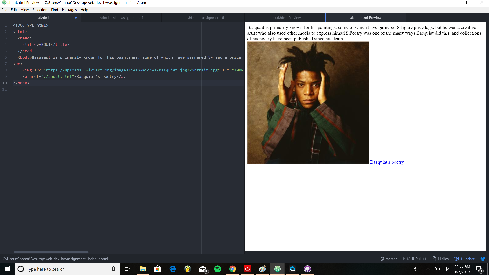

<h1>ASSIGNMENT 4 README</h1>
<ol>
<li>Using The Wayback Machine, I looked back on YouTube's homepage from 2006. The site has gone through a variety of design changes since then, both aesthetically and functionally. The site looks much more basic, and is neither as easy to use or nice to look at as its current iteration.</li>
<li>I have some previous experience using GitHub through the desktop app, and I really enjoy the workflow that it provides. This method makes editing and publishing pages very intuitive and smooth.</li>

